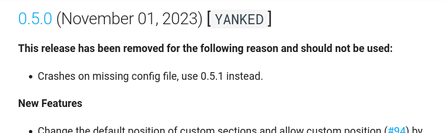

# Usage

!!! tip

    Read this section through to the end to learn how to configure and use the
    tool, and to see what configuration options are available.

    There are several ways to customize the output of the tool using command
    line options, the configuration file, and by using labels or naming on your
    PRs.

This tool is designed to be run from the root of a project, and will generate a
`CHANGELOG.md` file in the current folder using the GitHub Release and PR
history. It can also create a `CONTRIBUTORS.md` file if you want it to.

Note that this tool is designed to be run **after** you have merged your PRs,
and just **before** you create a new release. It will use the GitHub release
tags to determine each release.

!!! tip  "Get the most out of this tool"
    Since it also lists unreleased PRs, you can run it at any time and push the
    `CHANGELOG.md` file up to GitHub, to give users an idea of what is coming
    in the next release.

    The generated CHANGELOG uses the **Pull Request or Issue Title** for each
    item, it is recommended that you use clear and descriptive titles for your
    PRs. This will make the changelog much more useful and readable. It is
    always possible to edit the titles of your PRs after they have been merged,
    so if you have a PR with a vague title, you can edit it to be more
    descriptive before you run the tool.

## Basic Usage

Simply run the tool in the folder of a git repository and it will generate a
`CHANGELOG.md` file in the current folder. You can specify the name of the
repository you want to generate the changelog for using the `--repo` or `-r`
option:

```console
$ github-changelog-md --repo <repo-name>
```

!!! note "Automatic repository name detection"

    If you do not specify a repository name, the tool will try to determine the
    repository name from the current folder if it is a git repository. Failing
    that it will exit.

    Just run the command from the root of the repository you want to generate
    the changelog for, with no options:

    ```console
    $ github-changelog-md
    ```

This works for any repository that is linked to your username (determined from
the PAT), however if you want to generate a changelog for a repository that is
**not** linked to your username, you can specify the repository owner using the
`--user` or `-u` option.

```console
$ github-changelog-md --user <repo-owner> --repo <repo-name>
```

As mentioned in the [Installation](../installation.md) section, you will be
prompted for your GitHub PAT the first time you run the tool, and a config
file will be created in the current folder if it does not already exist.

## Release Section Headers

There are a few different section headers defined, which are used to group the
PRs in the changelog for each release. These are taken from the GitHub `labels`
applied to the PR. The default section headers are:

| **Title**            | **Label**       | **Notes**             |
|----------------------|-----------------|-----------------------|
| Breaking Changes     |      _breaking_ |                       |
| Merged Pull Requests |                 | Any PR with NO labels |
| Enhancements         |   _enhancement_ |                       |
| Bug Fixes            |           _bug_ |                       |
| Refactoring          |      _refactor_ |                       |
| Documentation        | _documentation_ |                       |
| Dependency Updates   |  _dependencies_ |                       |

You can tag each of your PRs with any of these labels to group them in the
changelog - If you are using `Dependabot`, by default it will add the
`dependencies` label.

!!! danger "Warning"

    For the moment, limit your PRs to a single label, as otherwise the tool will
    include the PR in each section it finds a label for. This will be improved
    in future versions. I also plan to add the ability to use
    multiple labels for the same section, eg `enhancement` and `enhancements`

Labels are **case-insensitive**, so `bug` or `BUG` will both match "Bug Fixes".
The above order is also the order that the sections will appear in the
changelog, again this order will be customizable in future versions.

!!! tip "Custom GitHub Labels"

    GitHub provides a few default labels, but you can also create your own
    custom labels and then add them to the `extend_sections` option in the
    config file. See [Custom Sections](#custom-sections) for more details.

    For example, the `breaking` and `refactor` labels are not default GitHub
    labels, but are ones I add to all my projects personally.

### Custom Sections

You can also **add** your own custom section headers, by adding a `label` to
your PRs that matches the `label` you specify in the config file. For example,
if you add the following to your config file:

```toml
extend_sections = [
  { title = "Automatic Testing", label = "testing" },
  { title = "Security", label = "security" },
]
```

Now, any PRs that have the `testing` label will be added to a section called
`Automatic Testing`, and `security` labels will be in `Security`. By default
these are inserted just before the `Dependency Updates` section, but you can
specify the `extend_sections_index` value in the config file to change the index
at which they they are inserted.

!!! warning "Be Aware of the Index!"

    The value of `extend_sections_index` is the **index** of the section, not
    the **position**. The first section has an index of `0`, the second has an
    index of `1`, etc. So if you want your custom sections to appear after the
    `Enhancements` section, you would set the `extend_sections_index` to `3`
    (the index of the next section, `Bug Fixes`)

    **HOWEVER** this index is the index of the **default** sections (listed
    above) that you want to insert BEFORE, even if those sections are not
    displayed. So an index of 0 to 2 could still be before the `Enhancements`
    section, if the `Breaking Changes` or `Merged Pull Requests` sections are
    not displayed. Play with the value to get the desired result :grin:.

    Finally, the `Closed Issues` section is separate and always displayed first
    regardless of the `extend_sections_index` value.

!!! tip "Verbose TOML Arrays"
    The format for this option is an [array of
    tables](https://toml.io/en/v1.0.0#array-of-tables){:target="_blank}, with
    each table containing a `title` and a `label`. The above example uses an
    `inline TOML array of tables` but the more verbose format will also work:

    ```toml
    [[changelog_generator.extend_sections]]
    title = "Automatic Testing"
    label = "testing"

    [[changelog_generator.extend_sections]]
    title = "Security"
    label = "security"
    ```

    **Verbose arrays like this must come at the end of the config file, after
    all the normal settings!**. Inline arrays can be with the other settings.

    Note the **double square brackets** and the inclusion of the
    `changelog_generator` prefix! Inline arrays as in the first example are
    just a bit easier to read and IMHO look nicer.

### Renaming Default Sections

You can also **rename** the default section headers using the `rename_sections`
option in the config file. For example, if you want to rename the `Enhancements`
section to `New Features`, you would add the following to your config file:

```toml
rename_sections = [{ old = "Enhancements", new = "New Features" }]
```

You specify the original title of the section you want to rename as `old`
(**case sensitive!**), and the new title as `new`. You can rename as many
sections as you
want, just add more tables to the array.

The same notes apply to this option as to the `extend_sections` option above,
you can use the inline array format or the verbose format as you prefer.

## Ignored Labels

There are a few labels that are ignored by default and will not be included in
the changelog. These are:

- `duplicate`
- `invalid`
- `question`
- `wontfix`

These are ignored for both PRs and Issues.

### Customizing Ignored Labels

There are three ways to customize the ignored labels, all using settings in the
config file. There are no equivalent command-line options for these settings.

#### `ignored_labels`

The `ignored_labels` setting is a definitive list of labels that should be
ignored. This totally replaces the default list. For example, if you only want
to ignore the `wontfix` label, but include every other label, you would add the
following to your config file:

```toml
ignored_labels = ["wontfix"]
```

!!! danger ""

    :sparkles: If this setting is present in your config file, the
    `extend_ignored` and `allowed_labels` settings will be silently ignored.

#### `extend_ignored`

The `extend_ignored` setting is a list of labels to add to the default list. For
example, if you don't want to list documentation changes in the changelog, you
could add the following to your config file:

```toml
extend_ignored = ["documentation"]
```

!!! danger ""

    :sparkles: This setting is ignored if you also have the `ignored_labels`
    setting in your config file.

#### `allowed_labels`

Finally, the `allowed_labels` setting is a list of labels that should be
included, even if they are in the default list. For example, if you want to
include the `question` label in the changelog, you could add the following to
your config file:

```toml
allowed_labels = ["question"]
```

!!! danger ""

    :sparkles: This setting is ignored if you also have the `ignored_labels`
    setting in your config file.

!!! Tip "Tip"

    You CAN combine the `extend_ignored` and `allowed_labels` settings if needed
    , but it is probably easier to just use the `ignored_labels` setting
    instead.

## Ignoring Specific Users

You can also ignore PRs and Issues from specific users, using the
`ignored_users` setting in the config file. For example, if you want to ignore
PRs and Issues from the `pre-commit-ci[bot]` user, you could add the following
to your config file:

```toml
ignored_users = ["pre-commit-ci[bot]"]
```

This is a list of strings and is optional. If you do not specify this setting,
all users will be included. This is NO command -line equivalent for this setting.

## Add an introductory paragraph

You can add an introductory paragraph to the top of the changelog, using the
`intro_text` setting in the config file. For example, if you want to add a paragraph
to the top of the changelog, you could add the following to your config file:

```toml
intro_text = """
This is an auto-generated log of all the changes that have been made to the
project since the first release.

This project adheres to [Semantic Versioning](https://semver.org/spec/v2.0.0.html).
"""
```

As seen above, you can use triple quotes to add a multi-line paragraph. If you
only have one line of text, use normal quotes:

```toml
intro_text = "This is the project Changelog."
```

!!! tip "Tip"

    This text is [Markdown](https://www.markdownguide.org/){:target="_blank"}
    formatted, so you can use any Markdown formatting you want. Remember that a
    single return in Markdown is ignored, so if you want a blank line between
    paragraphs, you need to add two returns.

The default value for this setting is an empty string, so if you do not specify
this setting, no introductory paragraph will be added.

## Add text to a specific release

You can add text to a specific release, using the `release_text` setting in the
config file. For example, if you want to add a paragraph to the `1.2.3` release,
you could add the following to your config file:

```toml
release_text = [
  { release = "1.2.3", text = "This is a paragraph for the 1.2.3 release." }
]
```

Generally you would add more than one line of text, so you can use triple quotes
and the verbose format:

```toml
[[changelog_generator.release_text]]
release = "1.2.3"
text = """
This is a longer paragraph for the 1.2.3 release. It can contain multiple lines
of text, and can use **Markdown formatting**.
"""
```

Using the special release tag "unreleased" you can add text to the top of the
'Unreleased' section too:

```toml
[[changelog_generator.release_text]]
release = "unreleased"
text = """
These are the changes that have been made to the main repository since the last
release. You can try out these by cloning the repository and installing locally.
Everything in this section will be included in the next release.
"""
```

!!! tip "Tip"

    In both cases, this text is
    [Markdown](https://www.markdownguide.org/){:target="_blank"} formatted, so
    you can use any Markdown formatting you want. Remember that a single return
    in Markdown is ignored, so if you want a blank line between paragraphs, you
    need to add two returns.

There is NO command-line equivalent for this setting.

Below is an example of how this looks in the changelog for this project:

!!! info ""

    

## Mark a release as "Yanked"

Sometimes you may need to mark a release as "Yanked" (or "Retracted") for
various reasons. You can do this using the `yanked` setting in the config file.
This is a list of dictionaries, with each dictionary containing the `release`
and `reason` keys. For example, if you want to mark the `1.2.3` release as
"Yanked", you could add the following to your config file:

```toml
yanked = [
  { release = "1.2.3", reason = "Ooooh, nasty nasty bug - use 1.2.4 instead!!!" }
]
```

!!! tip

    This only marks the release in the Changelog. It is up to you to actually
    remove/yank the release on GitHub, PyPI or wherever you have published it.

For an example of how this looks in the changelog, see below for an example from
this very project:
!!! info ""

    

You can add as many releases as you want to this list, just add more
dictionaries to the array - you can also use the more verbose format for arrays
as mentioned above. There is NO command-line equivalent for this setting.
